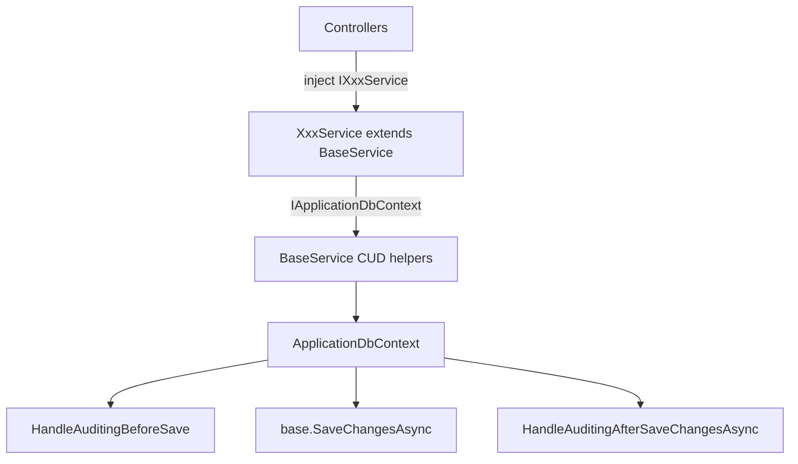

# Reduce domain events and remove MediatR

## Verification findings

### 1. MediatR — only wired, never meaningfully used

- **No real handlers exist.** The only MediatR handler file is an empty stub ([`CommandHandlerExample.cs`](Base.Application/Warehouses/Handlers/CommandHandlerExample.cs)).
- **`ValidatiomBehavior`** ([`ValidatiomBehavior.cs`](Base.Infrastructure/Validator/ValidatiomBehavior.cs)) is the only active MediatR consumer, but validation can be triggered directly in controllers or services using FluentValidation — no MediatR pipeline is needed.
- **`BaseController`** lazily resolves `ISender` but no controller actually calls `Mediator.Send(...)`.
- **`SearchProductRequest`** accidentally implements `IRequest<PaginatedResponse<ProductDto>>` — a leftover.
- **`AddMediatR`** is registered in [`Application/Startup.cs`](Base.Application/Startup.cs) scanning the assembly, adding overhead with zero benefit.

### 2. Domain events — effectively no-ops

- **No handlers exist.** [`IEventNotificationHandler.cs`](Base.Application/Common/Event/IEventNotificationHandler.cs) defines handler contracts, but no class implements them.
- **Events are raised only to be silently swallowed:** `EventAddingRepositoryDecorator` and `BaseService.CUD` add events → `SendDomainEventsAsync` in `ApplicationDbContext` → `EventPublisher` → MediatR `Publish` → **zero subscribers**.
- **DomainEventLog is forfeited** — `AuditTrail` already persists who changed what and when.

### 3. Two service patterns — consolidate on BaseService

| Service | Current pattern | Target pattern |
|---------|----------------|----------------|
| `WarehouseService` | ✅ `BaseService<T, TDto>` + `IApplicationDbContext` | No change |
| `CategoryService` | ❌ `IRepositoryWithEvents<T>` + `IReadRepository<T>` | Migrate |
| `CustomerService` | ❌ `IRepositoryWithEvents<T>` + `IReadRepository<T>` | Migrate |
| `DepartmentService` | ❌ `IRepositoryWithEvents<T>` + `IReadRepository<T>` | Migrate |
| `JobPositionService` | ❌ `IRepositoryWithEvents<T>` + `IReadRepository<T>` | Migrate |
| `InvoiceService` | ❌ `IRepositoryWithEvents<T>` + `IReadRepository<T>` | Migrate |
| `InvoiceItemService` | ❌ `IRepositoryWithEvents<T>` + `IReadRepository<T>` | Migrate |
| `PartLocationService` | ❌ `IRepositoryWithEvents<T>` + `IReadRepository<T>` | Migrate |
| `ProductService` | ❌ `IRepositoryWithEvents<T>` + `IReadRepository<T>` | Migrate |

`IReadRepository<T>` + Ardalis Specifications are only needed by services that are still on the old pattern. Once all services migrate, the spec files and `IReadRepository` registrations can be removed too.

---

## Target architecture

No MediatR. No `entity.DomainEvents`. No `IRepositoryWithEvents`. No `EventAddingRepositoryDecorator`.

---

## Implementation plan

### Phase 1 — Remove MediatR

**[`Base.Application/Base.Application.csproj`](Base.Application/Base.Application.csproj)**
- Remove `<PackageReference Include="MediatR" .../>`

**[`Base.Infrastructure/Base.Infrastructure.csproj`](Base.Infrastructure/Base.Infrastructure.csproj)**
- Remove `<PackageReference Include="MediatR" .../>`

**[`Base.Application/GlobalUsing.cs`](Base.Application/GlobalUsing.cs)**
- Remove `global using MediatR;`

**[`Base.Application/Startup.cs`](Base.Application/Startup.cs)**
- Remove `.AddMediatR(cfg => cfg.RegisterServicesFromAssembly(assembly))`

**[`Base.Infrastructure/Startup.cs`](Base.Infrastructure/Startup.cs)**
- Remove `.AddBehaviours(applicationAssembly)` call

**Delete from Base.Infrastructure:**
- [`Base.Infrastructure/Validator/ValidatiomBehavior.cs`](Base.Infrastructure/Validator/ValidatiomBehavior.cs)
- [`Base.Infrastructure/Validator/Startup.cs`](Base.Infrastructure/Validator/Startup.cs)
- Remove `Validator/` folder if empty

**[`Base.WebApi/Controllers/BaseController.cs`](Base.WebApi/Controllers/BaseController.cs)**
- Remove `using MediatR;`, remove `_mediator` field and `Mediator` property

**[`Base.Application/Products/Models/ProductCommands.cs`](Base.Application/Products/Models/ProductCommands.cs)**
- Remove `, IRequest<PaginatedResponse<ProductDto>>` from `SearchProductRequest`

**Delete from Base.Application:**
- [`Base.Application/Warehouses/Handlers/CommandHandlerExample.cs`](Base.Application/Warehouses/Handlers/CommandHandlerExample.cs)

### Phase 2 — Remove event publish/handler infrastructure

**Delete from Base.Application:**
- [`Base.Application/Common/Event/IEventPublisher.cs`](Base.Application/Common/Event/IEventPublisher.cs)
- [`Base.Application/Common/Event/EventNotification.cs`](Base.Application/Common/Event/EventNotification.cs)
- [`Base.Application/Common/Event/IEventNotificationHandler.cs`](Base.Application/Common/Event/IEventNotificationHandler.cs)
- Remove `Common/Event/` folder

**Delete from Base.Infrastructure:**
- [`Base.Infrastructure/Common/Services/EventPublisher.cs`](Base.Infrastructure/Common/Services/EventPublisher.cs)

**Delete from Base.Domain:**
- [`Base.Domain/Entities/Common/Contracts/DomainEvent.cs`](Base.Domain/Entities/Common/Contracts/DomainEvent.cs)
- [`Base.Domain/Entities/Common/Events/EntityCreatedEvent.cs`](Base.Domain/Entities/Common/Events/EntityCreatedEvent.cs)
- [`Base.Domain/Entities/Common/Events/EntityUpdatedEvent.cs`](Base.Domain/Entities/Common/Events/EntityUpdatedEvent.cs)
- [`Base.Domain/Entities/Common/Events/EntityDeletedEvent.cs`](Base.Domain/Entities/Common/Events/EntityDeletedEvent.cs)
- Remove `Common/Events/` folder

**Delete from Shared:**
- [`Shared/Events/IEvent.cs`](Shared/Events/IEvent.cs)
- Remove `Events/` folder if empty

**[`Base.Infrastructure/Persistence/Context/ApplicationDbContext.cs`](Base.Infrastructure/Persistence/Context/ApplicationDbContext.cs)**
- Remove `IEventPublisher` constructor parameter and field
- Remove `SendDomainEventsAsync` method and its call in `SaveChangesAsync`

**[`Migrators.PostgreSQL/PostgreSqlDbContextFactory.cs`](Migrators.PostgreSQL/PostgreSqlDbContextFactory.cs)**
- Remove `MockEventPublisher` and `IEventPublisher` references; update `ApplicationDbContext` constructor call

**[`Base.Application/Common/Services/BaseService.cs`](Base.Application/Common/Services/BaseService.cs)**
- Remove `entity.DomainEvents.Add(EntityCreated/Updated/DeletedEvent...)` lines from `CreateAsync`, `UpdateAsync`, `DeleteAsync`
- Remove `using Base.Domain.Entities.Common.Events;`

### Phase 3 — Remove IRepositoryWithEvents

**Delete:**
- [`Base.Infrastructure/Persistence/Repository/EventAddingRepositoryDecorator.cs`](Base.Infrastructure/Persistence/Repository/EventAddingRepositoryDecorator.cs)

**[`Base.Application/Persistence/Repository/IRepository.cs`](Base.Application/Persistence/Repository/IRepository.cs)**
- Remove `IRepositoryWithEvents<T>` interface

**[`Base.Infrastructure/Persistence/Startup.cs`](Base.Infrastructure/Persistence/Startup.cs) `AddRepositories`**
- Remove `IRepositoryWithEvents<>` decorator registration block; keep `IRepository<>` + `IReadRepository<>` only

### Phase 4 — Clean BaseEntity / IEntity

**[`Base.Domain/Entities/Common/Contracts/BaseEntity.cs`](Base.Domain/Entities/Common/Contracts/BaseEntity.cs)**
- Remove `_domainEvents` field, `DomainEvents` property, `AddDomainEvent`, `RemoveDomainEvent`, `ClearDomainEvents`
- Remove `[NotMapped]` attributes and `DomainEvent` references

**[`Base.Domain/Entities/Common/Contracts/IEntity.cs`](Base.Domain/Entities/Common/Contracts/IEntity.cs)**
- Remove `DomainEvents` property (if present)

### Phase 5 — Migrate 8 services to BaseService pattern

Each service inherits `BaseService<TEntity, TDto>(IApplicationDbContext context)` and drops `IRepositoryWithEvents<T>` + `IReadRepository<T>`. Replace `_eventRepos`/`_readRepos` calls with `BaseService` helpers:

| Old call | New call |
|----------|----------|
| `_eventRepos.AddAsync(entity, ct)` | `await base.CreateAsync(entity, ct)` |
| `_eventRepos.UpdateAsync(entity, ct)` | `await base.UpdateAsync(entity, ct)` |
| `_eventRepos.DeleteAsync(entity, ct)` | `await base.DeleteAsync(entity, ct)` |
| `_readRepos.GetByIdAsync(id, ct)` | `await FindAsync(id, ct)` |
| `_readRepos.ListAsync(spec, ct)` | `await ListAsync(ct)` or direct LINQ on `Entities` |
| `_readRepos.PaginatedListAsync(spec, ...)` | `await PaginatedSearchAsync(filter, ct)` |

Services to migrate:
- [`CategoryService.cs`](Base.Application/Categories/Services/CategoryService.cs)
- [`CustomerService.cs`](Base.Application/Customers/Services/CustomerService.cs)
- [`DepartmentService.cs`](Base.Application/Identities/Departments/Services/DepartmentService.cs)
- [`JobPositionService.cs`](Base.Application/Identities/JobPosistions/Services/JobPositionService.cs)
- [`InvoiceService.cs`](Base.Application/Invoices/Services/InvoiceService.cs)
- [`InvoiceItemService.cs`](Base.Application/InvoiceItems/Services/InvoiceItemService.cs)
- [`PartLocationService.cs`](Base.Application/PartLocations/Services/PartLocationService.cs)
- [`ProductService.cs`](Base.Application/Products/Services/ProductService.cs)

After all services are migrated, `IReadRepository<T>` and Ardalis-based `Specs` folders can be removed if no longer referenced.

### Phase 6 — Update copilot-instructions and verify build

**[`.github/copilot-instructions.md`](.github/copilot-instructions.md)**
- Remove all MediatR handler steps from the CRUD Handler Creation Process
- Update service template: inherit `BaseService<TEntity, TDto>(IApplicationDbContext context)` instead of injecting `IRepositoryWithEvents<T>` + `IReadRepository<T>`
- Remove handler creation process (no more 5 handlers per entity)
- Reference `WarehouseService` as the canonical example

**Build and verify:**
- Build `Base.Domain`, `Base.Application`, `Base.Infrastructure`, `Base.WebApi`, `Migrators.PostgreSQL`
- Smoke-test one CUD path (e.g. Category create/update) — no behavioral regression expected since domain event handlers never ran

---

## Out of scope

- DomainEventLog (forfeited — AuditTrail already covers this)
- Removing Ardalis `IReadRepository` / `IRepository` themselves (kept for potential future use)
- Removing `IReadRepository` registration from DI (kept until all specs are confirmed unused)
- Any new feature work

## Todo
- [x] Remove MediatR packages, global using, AddMediatR, ValidatiomBehavior, AddBehaviours, BaseController ISender, SearchProductRequest IRequest, CommandHandlerExample
- [x] Delete IEventPublisher, EventNotification, IEventNotificationHandler, EventPublisher; remove from ApplicationDbContext and PostgreSqlDbContextFactory
- [x] Delete DomainEvent, EntityCreatedEvent/Updated/Deleted, Shared IEvent; clean BaseService CUD
- [x] Delete EventAddingRepositoryDecorator; remove IRepositoryWithEvents from IRepository.cs; simplify AddRepositories
- [x] Remove DomainEvents collection from BaseEntity / IEntity
- [x] Migrate 8 services (Category, Customer, Department, JobPosition, Invoice, InvoiceItem, PartLocation, Product) to BaseService pattern
- [x] Update copilot-instructions.md; build all projects; verify CUD works
